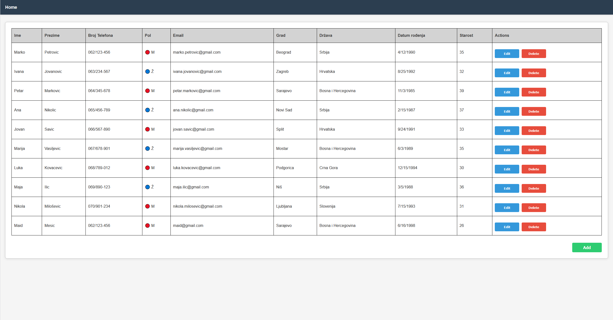
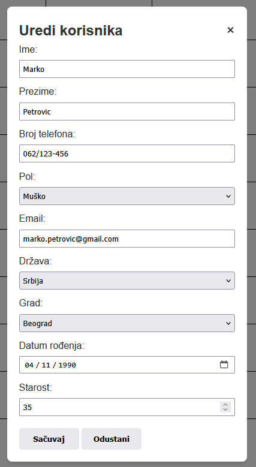

<div id="top"></div>
<div align="center">
  
  <h1 align="center">Directory App</h1>
  <p align="center">
    A .NET Core web application for managing contacts with dynamic city and country selection, built with EF Core, TypeScript, and MSSQL.
    <br />
  </p>
</div>

## About The Project

**Directory App** is a **.NET Core web application** that uses **Entity Framework Core** and **MSSQL** to manage a contact directory. The application provides a smooth interface for listing, adding, editing, and deleting contacts. Cities are dynamically loaded based on the selected country using the **fetch API**.

### Features

- Display all contacts in a table  
- Add new contacts via modal form  
- Edit contacts via modal form  
- Delete contacts directly from the table  
- Dynamic city selection based on the chosen country  
- Gender displayed as colored circles in the table (blue = male, red = female)  
- Automatic age calculation from date of birth  
- Validation for phone number and email formats  

<h3>Home Page<h3>


### Built With

- **ASP.NET Core (C#)** - Backend API framework
- **Entity Framework Core** - ORM for database operations
- **Microsoft SQL Server (MSSQL)** - Database management system
- **TypeScript** - Type-safe JavaScript development
- **HTML5, CSS3** - Frontend markup and styling

<p align="right">(<a href="#top">back to top</a>)</p>

<h3>Edit Form<h3>


### Tree Structure

```
Imenik-Projekt
├───Backend - Imenik
│   ├───bin
│   ├───Controllers
│   │   ├───DrzaveController.cs
│   │   ├───GradoviController.cs
│   │   └───KorisnikController.cs
│   ├───Data
│   │   ├───DataExtensions.cs
│   │   └───ImenikContext.cs
│   ├───Dtos
│   │   ├───DrzavaDto.cs
│   │   ├───GradDto.cs
│   │   └───OsobaDto.cs
│   ├───Entities
│   │   ├───Drzava.cs
│   │   ├───Grad.cs
│   │   └───Osoba.cs
│   ├───Mapping
│   ├───Migrations
│   │   ├───ImenikContextModelSnapshot.cs
│   │   ├───20250223183548_InitialCreate.cs
│   │   └───20250223183548_InitialCreate.Designer.cs
│   ├───Properties
│   │   ├───launchSettings.json
│   │   ├───appsettings.Development.json
│   │   └───appsettings.json
│   ├───Imenik.csproj
│   ├───Imenik.csproj.user
│   ├───korisnik.http
│   ├───Program.cs
│   ├───Imenik.sln
│   ├───ImenikDB.mdf
│   └───ImenikDB_log.ldf
├───Frontend - Imenik
│   ├───css
│   │   └───style.css
│   ├───js
│   │   └───script.js
│   ├───ts
│   │   └───scripts
│   ├───.gitignore
│   ├───index.html
│   ├───package-lock.json
│   ├───package.json
│   └───tsconfig.json
└───db.bacpac
```

<p align="right">(<a href="#top">back to top</a>)</p>

## Getting Started

### Prerequisites

- [.NET 6.0 SDK](https://dotnet.microsoft.com/download/dotnet/6.0) or later
- [SQL Server](https://www.microsoft.com/en-us/sql-server/sql-server-downloads) or SQL Server Express
- [Node.js](https://nodejs.org/) (for TypeScript compilation)
- A web browser

### Installation

1. **Clone the repository**
   ```sh
   git clone https://github.com/Maid-Type/Imenik.git
   cd Imenik
   ```

2. **Backend Setup**
   ```sh
   cd "Backend - Imenik"
   dotnet restore
   ```

3. **Database Setup**
   - Update the connection string in `appsettings.json`
   - Run migrations:
     ```sh
     dotnet ef database update
     ```
   - Or restore from the provided backup:
     ```sh
     # Import db.bacpac using SQL Server Management Studio
     ```

4. **Frontend Setup**
   ```sh
   cd "../Frontend - Imenik"
   npm install
   ```

### Running the Application

1. **Start the Backend API**
   ```sh
   cd "Backend - Imenik"
   dotnet run
   ```
   The API will be available at `https://localhost:7XXX` or `http://localhost:5XXX`

2. **Compile TypeScript (if needed)**
   ```sh
   cd "Frontend - Imenik"
   npx tsc
   ```

3. **Serve the Frontend**
   Open `index.html` in your web browser or use a local server:
   ```sh
   # Using Python
   python -m http.server 8000
   
   # Using Node.js
   npx serve .
   ```

<p align="right">(<a href="#top">back to top</a>)</p>

## Usage

1. **View Contacts**: The main page displays all contacts in a responsive table
2. **Add Contact**: Click the "Add New Contact" button to open a modal form
3. **Edit Contact**: Click the edit button in any row
4. **Delete Contact**: Click the delete button in any row
5. **Dynamic Cities**: When selecting a country, cities will automatically populate

<p align="right">(<a href="#top">back to top</a>)</p>
